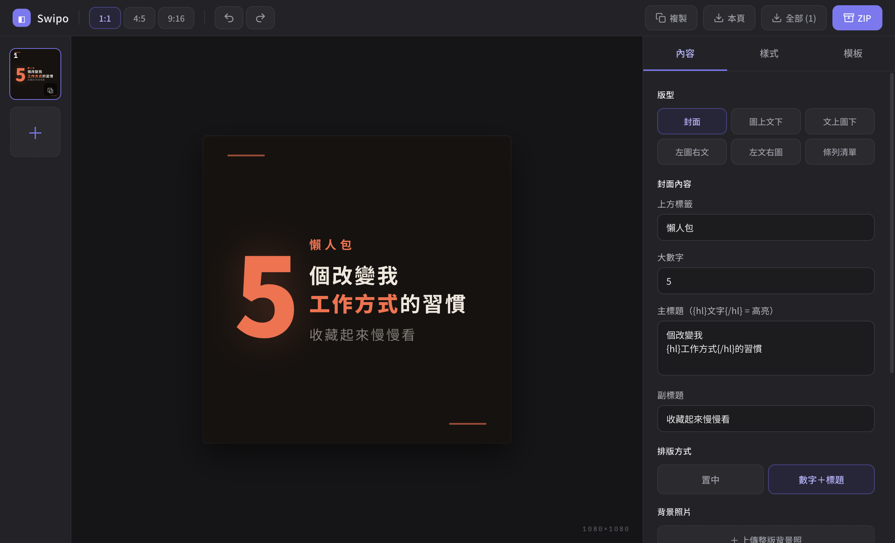

# Swipo

Instagram 輪播排版桌面工具。快速排出乾淨、好看的多頁輪播貼文，內建多種版型與模板，一鍵匯出。

## 下載

到 [Releases](../../releases) 下載最新版 dmg 安裝檔（macOS Apple Silicon）。

第一次打開請看 Releases 裡附的「Swipo 第一次打開說明」（這是免安裝認證的工具，第一次打開需要右鍵 → 打開）。

## 功能

- 6 種輪播版型：封面、圖文、條列、左右分欄等
- 多套原創模板，一鍵套用整套主題配色
- 背景照片疊字 + 漸層遮罩，文字壓在照片上也清楚
- 圖片拖拉、縮放、定位
- 數字浮水印、品牌帳號標記
- 一鍵匯出單頁 / 全部 / ZIP 打包，草稿自動儲存

## 關於

由 [Explorelad](https://www.instagram.com/explorelad) 製作，專注生活探索、數位行銷、影像製作與 AI 工具應用。
